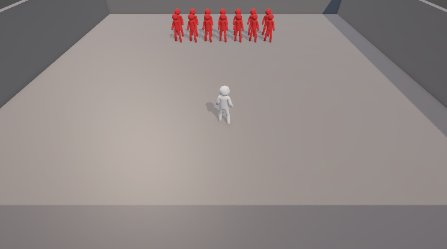

# Unity Ghost Player System 👻

<div align="center">


**A high-performance Unity system for recording and replaying player movements with ghost playback functionality**

[English](#english) | [Türkçe](#türkçe)


</div>

---

## 🇬🇧 English <a name="english"></a>

### 📖 Overview

Unity Ghost Player System is a comprehensive movement recording and playback solution that enables you to create multiple ghost replays of player actions. Perfect for racing games, speedrunning, training modes, and any game that needs to show previous attempts or AI learning.

### ✨ Key Features

| Feature | Description |
|---------|-------------|
| 🎬 **Movement Recording** | Records position, rotation, animation state, and input direction |
| 👻 **Ghost Playback** | Spawn unlimited ghost players that replay recorded movements |
| ⚡ **Performance Optimized** | Optional Unity Jobs System + Burst Compiler support |
| 🔄 **Time Control** | Adjustable speed, reverse playback, and seamless looping |
| 🪞 **Mirror Mode** | Horizontal flipping for competitive ghost comparisons |
| 🎨 **Visual Customization** | Customizable colors and transparency per ghost |
| ⏱️ **Precise Synchronization** | Drift correction for frame-perfect timing |
| 📊 **Debug Tools** | Built-in Gizmos and inspector controls |

### 🎥 Demo



### 🔧 Core Components

<details>
<summary><b>1. PlayerController</b> - Main player controller</summary>

**Features:**
- 8-directional movement snapping
- Jump mechanics with animation events
- Smooth rotation interpolation
- Unity Input System integration

**Inspector Settings:**
- Movement speed
- Jump configuration
- Rotation speed settings
</details>

<details>
<summary><b>2. MoveRecorder</b> - Records player data</summary>

**Features:**
- Circular buffer implementation
- Fixed timestep recording
- Jobs System optimization
- Debug visualization

**Inspector Settings:**
- Buffer size (default: 600 frames)
- Jobs System toggle
- Burst Compiler option
</details>

<details>
<summary><b>3. GhostPlayer</b> - Playback controller</summary>

**Features:**
- Smooth frame interpolation
- Time manipulation (speed/reverse/loop)
- Drift correction algorithm
- Mirror mode support

**Inspector Settings:**
- Time scale multiplier
- Playback delay
- Loop/reverse options
- Drift correction factor
</details>

<details>
<summary><b>4. GhostPlayerSpawner</b> - Multi-ghost manager</summary>

**Features:**
- Batch spawning system
- Individual timing offsets
- Color randomization
- Mirror pattern configuration

**Inspector Settings:**
- Number of ghosts
- Spawn delays
- Color palette
- Mirror patterns
</details>

<details>
<summary><b>5. Jobs System</b> - Performance optimization (Optional)</summary>

**Components:**
- `FrameInterpolationJob` - Burst-compiled blend calculation
- `BinarySearchJob` - Optimized frame lookup

**Performance Gains:**
- Classic Mode: ~0.1-0.2ms per ghost
- Jobs Mode: ~0.05-0.1ms per ghost
</details>

### 📦 Installation

#### Requirements
- Unity **2021.3** or later
- **Input System** package
- **Odin Inspector** (optional - for enhanced editor UI)

#### Setup Steps

1. **Import Scripts**
   ```
   📁 Your Project
   └── 📁 Scripts
       └── 📁 Game
           └── 📁 Player
               ├── 📁 Scripts
               │   ├── PlayerController.cs
               │   ├── GhostPlayer.cs
               │   ├── GhostPlayerSpawner.cs
               │   └── 📁 Jobs
               │       └── FrameInterpolationJob.cs
               └── 📁 Recorder
                   └── 📁 Scripts
                       ├── MoveRecorder.cs
                       ├── PlayerFrame.cs
                       └── 📁 Jobs
                           └── BinarySearchJob.cs
   ```

2. **Configure Player**
   - Attach `PlayerController` to your player GameObject
   - Assign Input Action References
   - Configure movement settings

3. **Setup Recording**
   - Add `MoveRecorder` component
   - Assign the PlayerController reference
   - Set buffer size (600 frames = ~10 seconds at 60fps)

4. **Create Ghost Prefab**
   - Duplicate your player model
   - Add `GhostPlayer` component
   - Remove player input components
   - Save as prefab

5. **Configure Spawner**
   - Create empty GameObject
   - Add `GhostPlayerSpawner`
   - Assign recorder and ghost prefab references

### 🎮 Usage Examples

#### Basic Recording & Playback

```csharp
// Recording starts automatically
// Access data programmatically:
public class GameManager : MonoBehaviour
{
    [SerializeField] private MoveRecorder recorder;
    [SerializeField] private GhostPlayer ghost;
    
    void Start()
    {
        // Get recording info
        float duration = recorder.GetRecordingDuration();
        int frameCount = recorder.FrameCount;
        Debug.Log($"Recorded {frameCount} frames over {duration}s");
        
        // Control playback
        ghost.Play();
        ghost.SetTimeScale(2.0f); // 2x speed
    }
}
```

#### Multiple Ghosts with Staggered Timing

```csharp
public class RaceManager : MonoBehaviour
{
    [SerializeField] private GhostPlayerSpawner spawner;
    
    void StartRace()
    {
        // Spawn 5 ghosts with 0.2s delay between each
        spawner.SpawnAllGhosts();
        spawner.PlayAllGhosts();
    }
    
    void ShowSlowMotion()
    {
        spawner.SetGhostTimeScale(0.5f); // Slow-mo replay
    }
}
```

#### Advanced Configuration

```csharp
// Precise timing control
ghostPlayer.SetPlaybackDelay(0.5f);     // 500ms initial delay
ghostPlayer.SetDriftCorrection(0.1f);   // Smooth synchronization

// Performance optimization
recorder.SetUseJobsSystem(true);        // Enable burst compilation
ghostPlayer.SetUseJobsSystem(true);

// Visual effects
ghost.ColorComponent.SetColor(new Color(1, 0, 0, 0.5f)); // Red semi-transparent
```

### ⚙️ Inspector Reference

#### MoveRecorder Settings

| Parameter | Description | Default |
|-----------|-------------|---------|
| Target | PlayerController reference | Required |
| Max Frames | Buffer capacity | 600 |
| Use Jobs System | Enable performance mode | false |
| Use Burst Compiler | Compile with Burst | true |

#### GhostPlayer Settings

| Parameter | Description | Range |
|-----------|-------------|-------|
| Time Scale | Playback speed multiplier | 0.1 - 5.0 |
| Auto Play | Start on enable | bool |
| Loop Playback | Repeat continuously | bool |
| Reverse Playback | Play backwards | bool |
| Playback Delay | Initial delay (seconds) | 0 - 10 |
| Drift Correction | Sync strength | 0.0 - 1.0 |
| Mirror Mode | Horizontal flip | bool |

#### GhostPlayerSpawner Settings

| Parameter | Description |
|-----------|-------------|
| Number of Ghosts | Count to spawn |
| Delay Between Ghosts | Stagger timing (seconds) |
| Playback Delay | Per-ghost offset |
| Randomize Colors | Use random palette |
| Ghost Colors | Color array |
| Mirror Pattern | Per-ghost mirror settings |

### 🔬 Performance Benchmarks

| Mode | Ghosts | Frame Time | CPU Usage |
|------|--------|-----------|-----------|
| Classic | 5 | 0.8ms | Low |
| Classic | 10 | 1.5ms | Medium |
| Jobs + Burst | 5 | 0.4ms | Very Low |
| Jobs + Burst | 20 | 1.2ms | Low |

**Recommendation:** Use Jobs System for 10+ simultaneous ghosts

### 📝 Data Structure

```csharp
public struct PlayerFrame
{
    public Vector3 position;          // World position
    public Quaternion rotation;       // World rotation
    public float normalizedAnimTime;  // Animation time
    public Vector2 moveDirection;     // Input direction
    public bool isJumping;            // Jump state
    public float time;                // Relative timestamp
}
```

### 🐛 Debugging

**Scene Visualization:**
- 🟦 Cyan line: Recorded path
- 🟩 Green sphere: Start position
- 🟥 Red sphere: End position

**Inspector Controls:**
- ▶️ Play/Pause/Stop buttons
- 🔄 Restart recording
- 🗑️ Clear buffer

**Debug Information:**
```
Buffer: 483/600 frames (80.5%) | Duration: 8.05s | Head: 483 | Mode: Jobs+Burst
```

### 🎯 Use Cases

- 🏁 **Racing Games** - Show previous lap ghosts
- 🎮 **Speedrunning** - Compare run attempts
- 🎓 **Training Modes** - Learn from recorded movements
- 🤖 **AI Learning** - Record and analyze behavior patterns
- 🎬 **Replay Systems** - Create cinematic replays
- 👥 **Multiplayer** - Asynchronous ghost competitions

### 🚀 Roadmap

- [ ] Network synchronization support
- [ ] Save/load recordings to disk
- [ ] Ghost interpolation quality settings
- [ ] Advanced animation blending
- [ ] Ghost prediction system

### 📄 License

This project is free to use and modify for personal and commercial projects.

### 🤝 Contributing

Contributions are welcome! Please feel free to submit a Pull Request.

1. Fork the repository
2. Create your feature branch (`git checkout -b feature/AmazingFeature`)
3. Commit your changes (`git commit -m 'Add some AmazingFeature'`)
4. Push to the branch (`git push origin feature/AmazingFeature`)
5. Open a Pull Request

### 📧 Support

- **Issues:** [GitHub Issues](your-repo-link)
- **Discussions:** [GitHub Discussions](your-repo-link)

### ⭐ Show Your Support

Give a ⭐️ if this project helped you!

---

## 🇹🇷 Türkçe <a name="türkçe"></a>

### 📖 Genel Bakış

Unity Ghost Player System, oyuncu aksiyonlarının birden fazla hayalet tekrarını oluşturmanızı sağlayan kapsamlı bir hareket kaydetme ve oynatma çözümüdür. Yarış oyunları, speedrun, eğitim modları ve önceki denemeleri veya yapay zeka öğrenimini göstermesi gereken her oyun için mükemmeldir.

### ✨ Temel Özellikler

| Özellik | Açıklama |
|---------|----------|
| 🎬 **Hareket Kaydı** | Pozisyon, rotasyon, animasyon durumu ve giriş yönünü kaydeder |
| 👻 **Hayalet Oynatma** | Kaydedilen hareketleri tekrar oynatan sınırsız hayalet oyuncu oluşturur |
| ⚡ **Performans Optimize** | İsteğe bağlı Unity Jobs System + Burst Compiler desteği |
| 🔄 **Zaman Kontrolü** | Ayarlanabilir hız, geri oynatma ve kesintisiz döngü |
| 🪞 **Ayna Modu** | Rekabetçi hayalet karşılaştırmaları için yatay çevirme |
| 🎨 **Görsel Özelleştirme** | Hayalet başına özelleştirilebilir renkler ve şeffaflık |
| ⏱️ **Hassas Senkronizasyon** | Kare mükemmel zamanlama için sapma düzeltme |
| 📊 **Hata Ayıklama Araçları** | Yerleşik Gizmos ve inspector kontrolleri |

### 🎥 Demo


### 🔧 Ana Bileşenler

<details>
<summary><b>1. PlayerController</b> - Ana oyuncu kontrolcüsü</summary>

**Özellikler:**
- 8 yönlü hareket yakalama
- Animasyon olaylarıyla zıplama mekaniği
- Yumuşak rotasyon interpolasyonu
- Unity Input System entegrasyonu

**Inspector Ayarları:**
- Hareket hızı
- Zıplama yapılandırması
- Rotasyon hızı ayarları
</details>

<details>
<summary><b>2. MoveRecorder</b> - Oyuncu verilerini kaydeder</summary>

**Özellikler:**
- Dairesel tampon uygulaması
- Sabit zaman adımı kaydı
- Jobs System optimizasyonu
- Debug görselleştirme

**Inspector Ayarları:**
- Tampon boyutu (varsayılan: 600 kare)
- Jobs System açma/kapama
- Burst Compiler seçeneği
</details>

<details>
<summary><b>3. GhostPlayer</b> - Oynatma kontrolcüsü</summary>

**Özellikler:**
- Yumuşak kare interpolasyonu
- Zaman manipülasyonu (hız/geri/döngü)
- Sapma düzeltme algoritması
- Ayna modu desteği

**Inspector Ayarları:**
- Zaman ölçeği çarpanı
- Oynatma gecikmesi
- Döngü/geri seçenekleri
- Sapma düzeltme faktörü
</details>

<details>
<summary><b>4. GhostPlayerSpawner</b> - Çoklu hayalet yöneticisi</summary>

**Özellikler:**
- Toplu oluşturma sistemi
- Bireysel zamanlama ofsetleri
- Renk rastgeleleştirme
- Ayna deseni yapılandırması

**Inspector Ayarları:**
- Hayalet sayısı
- Oluşturma gecikmeleri
- Renk paleti
- Ayna desenleri
</details>

<details>
<summary><b>5. Jobs System</b> - Performans optimizasyonu (İsteğe Bağlı)</summary>

**Bileşenler:**
- `FrameInterpolationJob` - Burst-derlenmiş karışım hesaplama
- `BinarySearchJob` - Optimize edilmiş kare arama

**Performans Kazançları:**
- Klasik Mod: Hayalet başına ~0.1-0.2ms
- Jobs Modu: Hayalet başına ~0.05-0.1ms
</details>

### 📦 Kurulum

#### Gereksinimler
- Unity **2021.3** veya üzeri
- **Input System** paketi
- **Odin Inspector** (isteğe bağlı - gelişmiş editör UI için)

#### Kurulum Adımları

1. **Scriptleri İçe Aktar**
   ```
   📁 Projeniz
   └── 📁 Scripts
       └── 📁 Game
           └── 📁 Player
               ├── 📁 Scripts
               │   ├── PlayerController.cs
               │   ├── GhostPlayer.cs
               │   ├── GhostPlayerSpawner.cs
               │   └── 📁 Jobs
               │       └── FrameInterpolationJob.cs
               └── 📁 Recorder
                   └── 📁 Scripts
                       ├── MoveRecorder.cs
                       ├── PlayerFrame.cs
                       └── 📁 Jobs
                           └── BinarySearchJob.cs
   ```

2. **Oyuncuyu Yapılandır**
   - `PlayerController`'ı oyuncu GameObject'inize ekleyin
   - Input Action Referanslarını atayın
   - Hareket ayarlarını yapılandırın

3. **Kaydı Kur**
   - `MoveRecorder` bileşenini ekleyin
   - PlayerController referansını atayın
   - Tampon boyutunu ayarlayın (600 kare = 60fps'de ~10 saniye)

4. **Hayalet Prefab Oluştur**
   - Oyuncu modelinizi kopyalayın
   - `GhostPlayer` bileşenini ekleyin
   - Oyuncu giriş bileşenlerini kaldırın
   - Prefab olarak kaydedin

5. **Spawner'ı Yapılandır**
   - Boş GameObject oluşturun
   - `GhostPlayerSpawner` ekleyin
   - Recorder ve hayalet prefab referanslarını atayın

### 🎮 Kullanım Örnekleri

#### Temel Kayıt ve Oynatma

```csharp
// Kayıt otomatik başlar
// Verilere programatik erişim:
public class GameManager : MonoBehaviour
{
    [SerializeField] private MoveRecorder recorder;
    [SerializeField] private GhostPlayer ghost;
    
    void Start()
    {
        // Kayıt bilgisini al
        float duration = recorder.GetRecordingDuration();
        int frameCount = recorder.FrameCount;
        Debug.Log($"{frameCount} kare, {duration} saniye içinde kaydedildi");
        
        // Oynatmayı kontrol et
        ghost.Play();
        ghost.SetTimeScale(2.0f); // 2x hız
    }
}
```

#### Kademeli Zamanlamalı Çoklu Hayaletler

```csharp
public class RaceManager : MonoBehaviour
{
    [SerializeField] private GhostPlayerSpawner spawner;
    
    void StartRace()
    {
        // Her biri arasında 0.2s gecikme ile 5 hayalet oluştur
        spawner.SpawnAllGhosts();
        spawner.PlayAllGhosts();
    }
    
    void ShowSlowMotion()
    {
        spawner.SetGhostTimeScale(0.5f); // Ağır çekim tekrar
    }
}
```

#### Gelişmiş Yapılandırma

```csharp
// Hassas zamanlama kontrolü
ghostPlayer.SetPlaybackDelay(0.5f);     // 500ms başlangıç gecikmesi
ghostPlayer.SetDriftCorrection(0.1f);   // Yumuşak senkronizasyon

// Performans optimizasyonu
recorder.SetUseJobsSystem(true);        // Burst derlemeyi etkinleştir
ghostPlayer.SetUseJobsSystem(true);

// Görsel efektler
ghost.ColorComponent.SetColor(new Color(1, 0, 0, 0.5f)); // Yarı saydam kırmızı
```

### ⚙️ Inspector Referansı

#### MoveRecorder Ayarları

| Parametre | Açıklama | Varsayılan |
|-----------|----------|------------|
| Target | PlayerController referansı | Gerekli |
| Max Frames | Tampon kapasitesi | 600 |
| Use Jobs System | Performans modunu etkinleştir | false |
| Use Burst Compiler | Burst ile derle | true |

#### GhostPlayer Ayarları

| Parametre | Açıklama | Aralık |
|-----------|----------|--------|
| Time Scale | Oynatma hızı çarpanı | 0.1 - 5.0 |
| Auto Play | Etkinleştiğinde başlat | bool |
| Loop Playback | Sürekli tekrarla | bool |
| Reverse Playback | Geri oynat | bool |
| Playback Delay | Başlangıç gecikmesi (saniye) | 0 - 10 |
| Drift Correction | Senkronizasyon gücü | 0.0 - 1.0 |
| Mirror Mode | Yatay çevirme | bool |

#### GhostPlayerSpawner Ayarları

| Parametre | Açıklama |
|-----------|----------|
| Number of Ghosts | Oluşturulacak sayı |
| Delay Between Ghosts | Kademeli zamanlama (saniye) |
| Playback Delay | Hayalet başına offset |
| Randomize Colors | Rastgele palet kullan |
| Ghost Colors | Renk dizisi |
| Mirror Pattern | Hayalet başına ayna ayarları |

### 🔬 Performans Karşılaştırması

| Mod | Hayalet | Kare Süresi | CPU Kullanımı |
|-----|---------|-------------|---------------|
| Klasik | 5 | 0.8ms | Düşük |
| Klasik | 10 | 1.5ms | Orta |
| Jobs + Burst | 5 | 0.4ms | Çok Düşük |
| Jobs + Burst | 20 | 1.2ms | Düşük |

**Öneri:** 10+ eşzamanlı hayalet için Jobs System kullanın

### 📝 Veri Yapısı

```csharp
public struct PlayerFrame
{
    public Vector3 position;          // Dünya pozisyonu
    public Quaternion rotation;       // Dünya rotasyonu
    public float normalizedAnimTime;  // Animasyon zamanı
    public Vector2 moveDirection;     // Giriş yönü
    public bool isJumping;            // Zıplama durumu
    public float time;                // Göreceli zaman damgası
}
```

### 🐛 Hata Ayıklama

**Sahne Görselleştirme:**
- 🟦 Cyan çizgi: Kaydedilen yol
- 🟩 Yeşil küre: Başlangıç pozisyonu
- 🟥 Kırmızı küre: Bitiş pozisyonu

**Inspector Kontrolleri:**
- ▶️ Play/Pause/Stop butonları
- 🔄 Kaydı yeniden başlat
- 🗑️ Tamponu temizle

**Debug Bilgisi:**
```
Buffer: 483/600 kare (%80.5) | Süre: 8.05s | Head: 483 | Mod: Jobs+Burst
```

### 🎯 Kullanım Alanları

- 🏁 **Yarış Oyunları** - Önceki tur hayaletlerini göster
- 🎮 **Speedrun** - Koşu denemelerini karşılaştır
- 🎓 **Eğitim Modları** - Kaydedilen hareketlerden öğren
- 🤖 **Yapay Zeka Öğrenimi** - Davranış kalıplarını kaydet ve analiz et
- 🎬 **Tekrar Sistemleri** - Sinematik tekrarlar oluştur
- 👥 **Çok Oyunculu** - Asenkron hayalet yarışmaları

### 🚀 Yol Haritası

- [ ] Ağ senkronizasyonu desteği
- [ ] Kayıtları diske kaydet/yükle
- [ ] Hayalet interpolasyon kalite ayarları
- [ ] Gelişmiş animasyon karıştırma
- [ ] Hayalet tahmin sistemi

### 📄 Lisans

Bu proje kişisel ve ticari projeler için kullanmak ve değiştirmek ücretsizdir.

### 🤝 Katkıda Bulunma

Katkılar memnuniyetle karşılanır! Lütfen Pull Request göndermekten çekinmeyin.

1. Depoyu fork edin
2. Feature branch'inizi oluşturun (`git checkout -b feature/HarikaOzellik`)
3. Değişikliklerinizi commit edin (`git commit -m 'Harika özellik eklendi'`)
4. Branch'e push yapın (`git push origin feature/HarikaOzellik`)
5. Pull Request açın

### 📧 Destek

- **Sorunlar:** [GitHub Issues](repo-linkiniz)
- **Tartışmalar:** [GitHub Discussions](repo-linkiniz)

### ⭐ Desteğinizi Gösterin

Bu proje size yardımcı olduysa bir ⭐️ bırakın!

---

<div align="center">

**Made with ❤️ for Unity Developers**

[⬆ Back to top](#unity-ghost-player-system-)

</div>